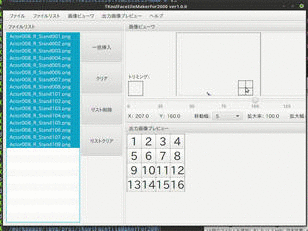

TKool Facetile Maker For 2000 マニュアル
================================================================================

- バージョン       : 1.1.1
- 作者             : 次郎(Jiro)
- 作成日           : 2017/03/12
- 最終更新日       : 2017/03/12
- 連絡先           : [次ログ](http://jiroron666.hatenablog.com/)
- 実行ファイル名   : tkfmf2000.jar
- 動作確認・開発環境
  - OS             : Linux Mint 18.1
  - プロセッサ     : 2.00GHz Intel Core i7-3667U
  - メモリ         : 8GB RAM
  - Javaバージョン : 1.8.0-121

目次
--------------------------------------------------------------------------------

- [ソフトウェア概要 ] ( #ソフトウェア概要 )
- [変更点           ] ( #変更点           )
- [実行方法         ] ( #実行方法         )
- [更新履歴         ] ( #更新履歴         )

ソフトウェア概要
--------------------------------------------------------------------------------

このソフトはRPGツクールMV, VXACE用に作成したTKoolFacetileMaker2の機能変更版です
。

基本的な機能はTKFM2と同じですが、一部仕様を変更しています。

操作説明や内容については基本的に全く同じなので、操作説明の詳細は
[TKoolFacetileMaker2](https://github.com/jiro4989/TKoolFacetileMaker2)のREADMEを
参照してください。

このREADMEではTKFM2との違いのみ説明します。

ファイル構成
--------------------------------------------------------------------------------

zip配布時の構成

- README.html        : READMEへのリンク
- java_download.html : Javaアップデート公式サイトへのリンク
- tkfmf2000.jar      : 実行ファイル
- properties         : 設定ファイル管理フォルダ

上記の生成されるフォルダ類は、アンインストールする時以外に場所を移動したり、削除
したりしないようにしてください。予期せぬ動作の原因になります。

変更点
--------------------------------------------------------------------------------

- TKFM2ではツクールの規格をMV,VXACEに変更できていましたが、こちらのバージョンで
  は変更できません。ツクール2000専用ツールになります。

- ツクール2000用にパネルの数が2x4から4x4に変更しています。それに伴って、出力画像
  プレビューメニューの選択項目数も16に拡張しています。

- Javaのバージョンが1.8.0-101から1.8.0-121にバージョンアップしています。マイナー
  バージョンのみの変更なのでおそらく動作すると思いますが、もし実行できなかったら
  Javaをバージョンアップしてみてください。

- ***properteisフォルダとそれに同封のpropertiesファイルは必須***になっています。
  これらのファイルを削除してしまうと起動できなくなります。誤って削除してしまった
  場合は、お手数ですが、ダウンロードページから設定ファイル同封のzipを落としなお
  してください。

  理由としましては、私のどんくさいミスで過去に自分が作成したプログラムの一部を誤
  って上書き保存して消してしまっていたせいです。

更新履歴
--------------------------------------------------------------------------------

2017/03/12: Ver1.0.0
- プログラム公開

2017/03/12: Ver1.1.0
- 色の処理を255色に変更

2017/03/12: Ver1.1.1
- 減色処理を追加

